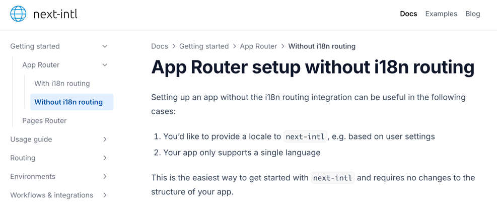

# Internationalization

## Installation

* Install the package: `npm install next-intl`

## Messages

* [en.json](../../messages/en.json)
* [de.json](../../messages/de.json)

> The `messages` should be in the root directory. If moved to `public`, they will need to be fetched via API calls.

## Configuration

* Set up the service to fetch the files: [services.ts](../../modules/i18n/services.ts)
* Set up the configurations:
  * [config.ts](../../i18n/config.ts)
  * [locale.ts](../../i18n/locale.ts)
  * [request.ts](../../i18n/request.ts)
  > The `i18n` directory, containing the configuration files, must be placed in the root directory to allow direct access to the message files.
* Set up the plugin in [next.config.js](../../next.config.js)

* Configure the root layout with the `NextIntlClientProvider`: [layout.tsx](../../app/layout.tsx)
* Use translations: [faded-home/index.tsx](../../modules/global/screens/home/faded-home/index.tsx)

## Components

* Create the switcher:
  * [locale-switcher.tsx](../../modules/i18n/components/locale-switcher.tsx)
  * [locale-switcher-select.tsx](../../modules/i18n/components/locale-switcher-select.tsx)
* Use the switcher in [navbar.tsx](../../modules/global/components/navbar.tsx)

## Resources

* [App Router setup without i18n routing](https://next-intl.dev/docs/getting-started/app-router/without-i18n-routing)
